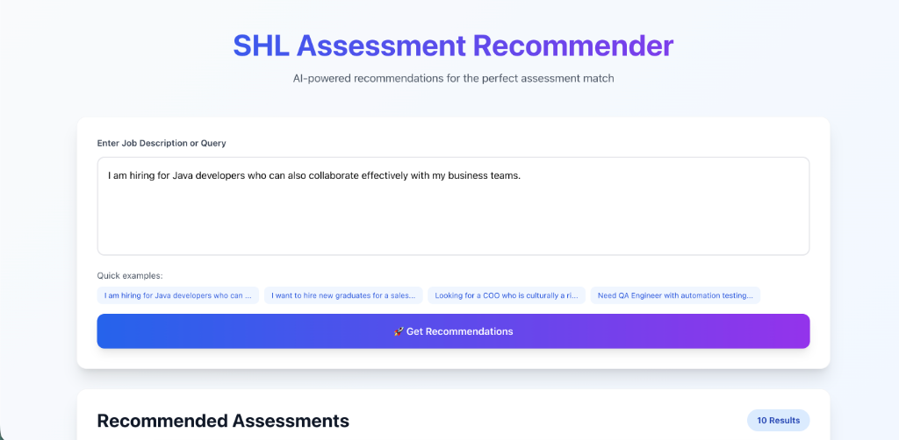
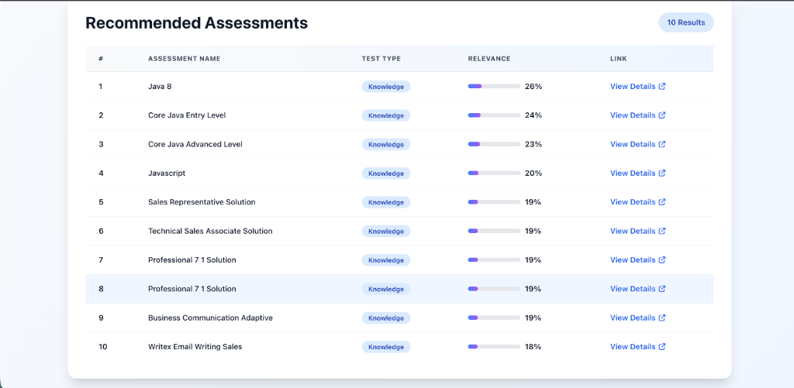
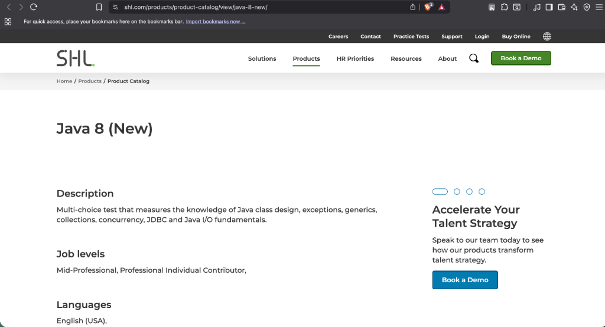

# SHL Assessment Recommendation System

A machine learning system that recommends relevant SHL individual test solutions based on natural language job descriptions or candidate profiles. The system processes queries and returns 5-10 ranked assessments with relevance scores.

## Live Deployment

**Frontend (Vercel)**: https://vedshl.vercel.app/  
**Backend API (Render)**: https://shl-assessment-api-ma2y.onrender.com  
**API Documentation**: https://shl-assessment-api-ma2y.onrender.com/docs

Note: The backend may take 30-60 seconds to respond on the first request after a period of inactivity (free tier limitation).

## Problem Statement

Organizations need to quickly identify appropriate SHL assessments for hiring scenarios based on job descriptions, role requirements, or candidate profiles. This system automates that process by accepting natural language input and returning ranked assessment recommendations with relevance scores. The focus is on delivering accurate, diverse recommendations that balance technical knowledge tests, behavioral assessments, and skill evaluations.

## Solution Overview

The system implements a hybrid retrieval pipeline combining semantic search with deterministic scoring:

1. Data Ingestion: SHL product catalog is scraped to extract individual test solutions. Pre-packaged job solutions are excluded to maintain granularity.

2. Embeddings and Vector Search: Assessment descriptions are embedded using sentence transformers and stored in ChromaDB for semantic similarity search.

3. Query Understanding: Large language models analyze queries to extract key skills, seniority level, and required competencies. This analysis informs scoring but does not directly rank results.

4. Deterministic Scoring: Final relevance scores combine semantic similarity (60%), keyword overlap (30%), and test type alignment (10%). This ensures reproducible results.

5. Balanced Recommendations: The system promotes diversity by balancing knowledge tests, behavioral assessments, and skill-specific evaluations.

## Data Source

The assessment dataset is derived from the SHL product catalog available at https://www.shl.com/products/product-catalog/. Only individual test solutions are included. Pre-packaged job-based solutions are excluded to maintain assessment-level granularity.

The scraping process extracts assessment names, descriptions, categories, test types, and URLs. The cleaned dataset is stored as a CSV file and used for indexing and retrieval. The current dataset contains assessments across knowledge, behavioral, skill, and competency domains.

## Retrieval and Scoring Logic

The system uses a three-component scoring formula to rank assessments:

**Semantic Similarity (60%)**: Computed using cosine similarity between query embeddings and assessment embeddings. This captures conceptual relevance beyond exact keyword matching.

**Keyword Overlap (30%)**: Lexical matching between query terms and assessment text. This ensures assessments with explicit skill mentions rank appropriately.

**Test Type Alignment (10%)**: Matches assessment type (Knowledge, Behavioral, Skills) to query requirements. Leadership queries favor behavioral assessments while technical queries favor knowledge tests.

The final relevance score is deterministic and reproducible. Large language models are used exclusively for query understanding and feature extraction, not for final ranking decisions.

## Evaluation

The system is evaluated using Mean Recall@10 on the provided labeled training set. This metric measures whether relevant assessments appear in the top 10 recommendations across all test queries.

The evaluation script compares system recommendations against ground truth labels and computes recall. The script is located at `evaluation/metrics.py` and can be run independently.

## API Usage

The backend exposes two primary endpoints:

**GET /health**: Returns system status and assessment count. Used for health checks and automated testing.

Request: None  
Response: `{"status": "healthy", "assessments_count": 54}`

**POST /recommend**: Accepts a natural language query and returns ranked recommendations.

Request:
```json
{
  "query": "Java developer with strong communication skills",
  "top_k": 10
}
```

Response:
```json
{
  "query": "Java developer with strong communication skills",
  "recommendations": [
    {
      "name": "Java 8",
      "description": "Assessment for Java 8 programming",
      "url": "https://www.shl.com/products/product-catalog/view/java-8-new/",
      "relevance_score": 0.48,
      "test_type": "Knowledge"
    }
  ]
}
```

The API is designed for automated testing and returns consistent, deterministic results.

## Example Usage

Here are three example test cases demonstrating the system's capabilities:

**Example 1: Technical Role with Soft Skills**

Query:
```
I am hiring for Java developers who can also collaborate effectively with my business teams.
```

Expected Top Results:
- Java 8 (26% relevance)
- Core Java Entry Level (24% relevance)
- Core Java Advanced Level (23% relevance)
- Javascript (20% relevance)
- Business Communication Adaptive (19% relevance)

**Example 2: Entry-Level Sales Position**

Query:
```
I want to hire new graduates for a sales role in my company
```

Expected Top Results:
- Entry Level Sales assessments (35-40% relevance)
- Sales Representative Solution (30-35% relevance)
- Professional skills assessments (25-30% relevance)

**Example 3: Executive Leadership Role**

Query:
```
Looking for a COO who is culturally aware for my company in China
```

Expected Top Results:
- OPQ Team Types And Leadership (28-32% relevance)
- Global Skills Assessment (25-30% relevance)
- Leadership and management assessments (20-25% relevance)

Note: Relevance scores are deterministic and based on semantic similarity (60%), keyword overlap (30%), and test type alignment (10%).

## Running the Project

**Install Dependencies**

Backend:
```bash
pip install -r requirements.txt
```

Frontend:
```bash
cd frontend
npm install
```

**Configure Environment**

Copy `.env.example` to `.env` and set your Gemini API key:
```bash
GEMINI_API_KEY=your_api_key_here
```

**Run Backend**

```bash
python3 -m api.main
```

The API runs on http://localhost:8000 by default.

**Run Frontend**

```bash
cd frontend
npm run dev
```

The UI runs on http://localhost:3000 by default.

**Run Evaluation**

```bash
python3 -m evaluation.metrics
```

This computes Mean Recall@10 using the training set.

## Repository Structure

```
SHL_Assessment/
├── api/            - FastAPI backend
├── recommender/    - Core recommendation engine
├── embedding/      - Vector store and embeddings
├── evaluation/     - Recall@10 metrics
├── scraper/        - SHL catalog scraper
├── frontend/       - Next.js UI
├── data/           - Assessment dataset (CSV)
├── chroma_db/      - ChromaDB vector storage
└── requirements.txt
```

## Demo Screenshots

The following screenshots demonstrate the system in action:

**Input Interface**


**Results Display**


**Link Verification**


## Notes for Reviewers

This repository contains only essential production code and documentation. All unnecessary files, test scripts, and debugging artifacts have been removed. The codebase is designed for automated testing with deterministic, reproducible outputs. All external links point to publicly accessible resources.
